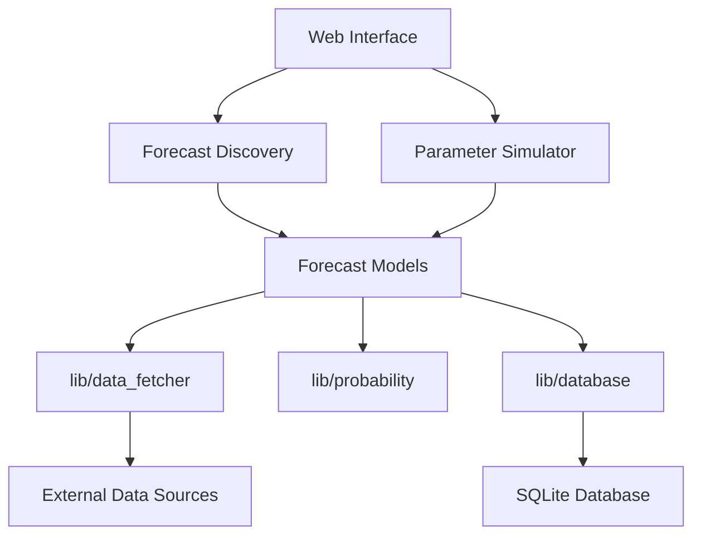

# Design Document

## Overview

The Polymarket Forecasting Simulator is a modular Python application that enables users to build, manage, and visualize probabilistic forecasts for prediction markets. The system follows a plugin-like architecture where each forecast problem lives in its own directory with dedicated scripts, data, and database tables. A shared library provides common utilities for data processing, probability calculations, and database operations. A lightweight Flask web interface dynamically discovers forecast models and provides interactive parameter simulation.

The initial implementation includes a US recession forecast model that analyzes economic indicators to predict recession probability by end of 2025.

## Architecture

### High-Level Structure

```
polymarket-forecasting-simulator/
├── lib/
│   ├── __init__.py
│   ├── data_fetcher.py      # Data retrieval utilities
│   ├── probability.py        # Probability calculation helpers
│   ├── database.py           # SQLite operations
│   └── utils.py              # General utilities
├── forecasts/
│   ├── __init__.py
│   └── us_recession_2025/
│       ├── __init__.py
│       ├── model.py          # Main forecast logic
│       ├── data.py           # Data collection specific to this forecast
│       ├── config.py         # Model parameters and configuration
│       └── README.md         # Documentation
├── web/
│   ├── __init__.py
│   ├── app.py                # Flask application
│   ├── templates/
│   │   ├── base.html
│   │   ├── index.html
│   │   └── forecast.html
│   └── static/
│       ├── css/
│       └── js/
├── data/
│   └── forecasts.db          # SQLite database
├── requirements.txt
└── README.md
```

### Component Interaction



### Design Principles

1. **Modularity**: Each forecast is self-contained with its own directory, configuration, and database table
2. **Discoverability**: The web interface automatically detects forecast models by scanning the forecasts/ directory
3. **Reusability**: Common functionality lives in lib/ and is imported by forecast models
4. **Simplicity**: Use Flask for lightweight web serving, SQLite for local persistence, minimal dependencies
5. **Extensibility**: Adding a new forecast requires only creating a new directory with standard structure

## Components and Interfaces

### 1. Forecast Model Interface

Each forecast model must implement a standard interface:

```python
class ForecastModel:
    """Base interface for all forecast models"""
    
    def get_name(self) -> str:
        """Return human-readable forecast name"""
        pass
    
    def get_description(self) -> str:
        """Return forecast description"""
        pass
    
    def get_parameters(self) -> dict:
        """Return adjustable parameters with metadata"""
        pass
    
    def calculate_probability(self, params: dict = None) -> float:
        """Calculate and return probability (0-1)"""
        pass
    
    def get_last_updated(self) -> datetime:
        """Return timestamp of last data update"""
        pass
```

### 2. Library Components

#### data_fetcher.py
- `fetch_fred_data(series_id, start_date, end_date)`: Fetch economic data from FRED API
- `fetch_csv_data(url)`: Download and parse CSV data
- `cache_data(key, data, ttl)`: Cache data locally with expiration
- `get_cached_data(key)`: Retrieve cached data

#### probability.py
- `normalize_probability(value)`: Ensure value is between 0 and 1
- `combine_probabilities(probs, weights)`: Weighted combination of multiple probability estimates
- `logistic_transform(x, params)`: Apply logistic function for probability mapping
- `bayesian_update(prior, likelihood, evidence)`: Bayesian probability update

#### database.py
- `get_connection()`: Get SQLite database connection
- `create_forecast_table(forecast_name, schema)`: Create table for a forecast
- `save_forecast_result(forecast_name, probability, params, timestamp)`: Store forecast output
- `get_forecast_history(forecast_name, limit)`: Retrieve historical forecasts
- `execute_query(query, params)`: Execute arbitrary SQL query

#### utils.py
- `load_config(forecast_name)`: Load forecast configuration
- `setup_logging(forecast_name)`: Configure logging for a forecast
- `validate_parameters(params, schema)`: Validate parameter inputs

### 3. US Recession Forecast Model

The recession model analyzes multiple economic indicators:

**Data Sources:**
- Yield curve (10Y-2Y Treasury spread) - FRED: T10Y2Y
- Unemployment rate - FRED: UNRATE
- GDP growth rate - FRED: GDP
- Consumer confidence index - FRED: UMCSENT
- Leading economic indicators - FRED: USSLIND
- Initial jobless claims - FRED: ICSA

**Model Approach:**
1. Fetch latest data for all indicators
2. Calculate z-scores for each indicator relative to historical distribution
3. Apply weighted logistic regression based on historical recession patterns
4. Combine signals using Bayesian updating
5. Output final probability with confidence interval

**Adjustable Parameters:**
- `yield_curve_weight`: Weight for yield curve signal (default: 0.35)
- `unemployment_weight`: Weight for unemployment signal (default: 0.25)
- `gdp_weight`: Weight for GDP signal (default: 0.20)
- `confidence_weight`: Weight for consumer confidence (default: 0.10)
- `leading_indicators_weight`: Weight for LEI (default: 0.10)
- `lookback_days`: Historical window for analysis (default: 365)

### 4. Web Interface

**Flask Application Structure:**
- `/`: Home page listing all forecasts
- `/forecast/<name>`: Display specific forecast with current probability
- `/forecast/<name>/simulate`: Interactive parameter adjustment
- `/api/forecast/<name>`: JSON API endpoint for probability calculation
- `/api/forecasts`: List all available forecasts

**Frontend Features:**
- Sidebar navigation with all discovered forecasts
- Main panel showing current probability as large percentage
- Historical probability chart (line graph over time)
- Parameter adjustment sliders/inputs
- Real-time probability recalculation on parameter change
- Last updated timestamp
- Data source information

### 5. Forecast Discovery Mechanism

The system discovers forecasts by:
1. Scanning `forecasts/` directory for subdirectories
2. Checking each subdirectory for `model.py` with `ForecastModel` class
3. Importing and instantiating the model
4. Registering it in the web interface navigation

## Data Models

### Database Schema

#### forecast_metadata table
```sql
CREATE TABLE forecast_metadata (
    id INTEGER PRIMARY KEY AUTOINCREMENT,
    name TEXT UNIQUE NOT NULL,
    display_name TEXT NOT NULL,
    description TEXT,
    created_at TIMESTAMP DEFAULT CURRENT_TIMESTAMP,
    last_updated TIMESTAMP
);
```

#### us_recession_2025 table
```sql
CREATE TABLE us_recession_2025 (
    id INTEGER PRIMARY KEY AUTOINCREMENT,
    probability REAL NOT NULL CHECK(probability >= 0 AND probability <= 1),
    yield_curve_value REAL,
    unemployment_rate REAL,
    gdp_growth REAL,
    consumer_confidence REAL,
    leading_indicators REAL,
    parameters TEXT,  -- JSON string of parameters used
    calculated_at TIMESTAMP DEFAULT CURRENT_TIMESTAMP
);
```

#### Generic forecast result table pattern
```sql
CREATE TABLE forecast_{name} (
    id INTEGER PRIMARY KEY AUTOINCREMENT,
    probability REAL NOT NULL CHECK(probability >= 0 AND probability <= 1),
    parameters TEXT,  -- JSON string of parameters
    data_snapshot TEXT,  -- JSON string of input data
    calculated_at TIMESTAMP DEFAULT CURRENT_TIMESTAMP
);
```

### Python Data Models

```python
@dataclass
class ForecastResult:
    name: str
    probability: float
    parameters: dict
    data_snapshot: dict
    calculated_at: datetime
    confidence_interval: tuple[float, float] = None

@dataclass
class ForecastParameter:
    name: str
    display_name: str
    type: str  # 'float', 'int', 'bool', 'select'
    default: any
    min_value: any = None
    max_value: any = None
    options: list = None
    description: str = ""

@dataclass
class EconomicIndicator:
    series_id: str
    name: str
    value: float
    date: datetime
    source: str
```


## Correctness Properties

*A property is a characteristic or behavior that should hold true across all valid executions of a system—essentially, a formal statement about what the system should do. Properties serve as the bridge between human-readable specifications and machine-verifiable correctness guarantees.*

### Property 1: Probability bounds enforcement

*For any* forecast model and any set of input parameters, the calculated probability output must be a value between 0 and 1 (inclusive).

**Validates: Requirements 2.1**

**Reasoning:** The recession model (and all forecast models) must always produce valid probabilities. By testing with random or varied inputs, we ensure the model never produces invalid outputs like negative values or values greater than 1, regardless of extreme or unusual input data.

### Property 2: Economic indicators collection

*For any* execution of the recession forecast model, the system must successfully fetch and process all configured economic indicators before calculating the probability.

**Validates: Requirements 2.2**

**Reasoning:** The model's correctness depends on having complete data. We can verify that each model execution attempts to fetch all required indicators (yield curve, unemployment, GDP, etc.) and that the calculation only proceeds when data is available.

### Property 3: Database persistence

*For any* forecast model execution that produces a probability, the system must store that result in the corresponding SQLite table with a timestamp.

**Validates: Requirements 2.5, 6.4**

**Reasoning:** Every forecast calculation should be persisted for historical tracking. We can run the model, then query the database to verify a new record exists with the correct probability value and a valid timestamp.

### Property 4: Parameter modification triggers recalculation

*For any* forecast model and any parameter modification, changing a parameter value must produce a recalculated probability that may differ from the original.

**Validates: Requirements 5.2**

**Reasoning:** The parameter simulator must be responsive to changes. We can test that modifying any parameter (within valid ranges) triggers the model to recalculate, demonstrating that parameters actually affect the output.

### Property 5: Parameter validation

*For any* forecast model parameter with defined constraints (min/max values, allowed options), the system must reject inputs outside those constraints and accept inputs within them.

**Validates: Requirements 5.4**

**Reasoning:** Invalid parameters should never reach the model calculation. We can generate random valid and invalid parameter values and verify that validation correctly accepts/rejects them based on the defined constraints.

### Property 6: Simulation state preservation

*For any* forecast model, running a simulation with modified parameters and then running again with default parameters must produce the same probability as the initial default run (assuming data hasn't changed).

**Validates: Requirements 5.5**

**Reasoning:** Simulations should be non-destructive. We can run the model with defaults, record the result, run with modified parameters, then run with defaults again and verify we get the same initial result, proving the model state wasn't permanently altered.

### Property 7: Forecast table creation

*For any* new forecast model added to the system, initializing that model must create a corresponding SQLite table with the appropriate schema.

**Validates: Requirements 6.3**

**Reasoning:** Each forecast needs its own data storage. We can create a new forecast model, initialize it, and verify that a table with the expected name and schema exists in the database.

### Property 8: Navigation reflects directory structure

*For any* set of forecast directories in the forecasts/ folder, the web interface navigation must include exactly those forecasts that have valid model.py files, and exclude any that don't or have been removed.

**Validates: Requirements 7.2, 7.3, 7.5**

**Reasoning:** The UI must stay synchronized with the filesystem. We can create various forecast directories (some valid, some invalid), initialize the web interface, and verify the navigation contains exactly the valid forecasts. This consolidates the requirements about adding and removing forecasts.

## Error Handling

### Data Fetching Errors
- **Network failures**: Retry with exponential backoff (3 attempts), then use cached data if available
- **API rate limits**: Implement request throttling and respect rate limit headers
- **Missing data points**: Log warning, use interpolation or last known value, flag forecast as "incomplete data"
- **Invalid data format**: Validate data schema, reject and log error, prevent calculation with bad data

### Calculation Errors
- **Division by zero**: Check denominators before division, use epsilon values where appropriate
- **Numerical overflow**: Use appropriate data types (float64), clip extreme values
- **Invalid parameter combinations**: Validate parameter relationships before calculation
- **Model convergence failures**: Set maximum iterations, return last valid state with warning

### Database Errors
- **Connection failures**: Retry connection, create database file if missing
- **Table creation conflicts**: Check if table exists before creation, handle race conditions
- **Write failures**: Use transactions, rollback on error, log failure details
- **Schema mismatches**: Version database schema, provide migration path

### Web Interface Errors
- **Forecast not found**: Return 404 with helpful message listing available forecasts
- **Invalid parameter input**: Return 400 with validation error details
- **Calculation timeout**: Set reasonable timeout (30s), return 503 with retry suggestion
- **Template rendering errors**: Catch exceptions, return 500 with generic error page

### General Error Handling Principles
- All errors must be logged with context (timestamp, forecast name, parameters, stack trace)
- User-facing errors must be clear and actionable
- System must fail gracefully without corrupting data
- Critical errors must prevent calculation rather than producing incorrect results

## Testing Strategy

### Unit Testing

Unit tests will verify specific examples and edge cases:

**lib/ utilities:**
- `test_normalize_probability`: Test with values below 0, above 1, and within range
- `test_combine_probabilities`: Test with empty list, single probability, multiple probabilities
- `test_database_connection`: Test connection creation, reuse, and cleanup
- `test_cache_expiration`: Test that cached data expires correctly

**Forecast models:**
- `test_recession_model_with_known_data`: Test with historical data from known recession period
- `test_recession_model_with_boom_data`: Test with data from economic expansion period
- `test_parameter_defaults`: Verify default parameters produce expected output
- `test_missing_indicator_handling`: Test behavior when one indicator is unavailable

**Web interface:**
- `test_forecast_discovery`: Test that valid forecasts are discovered
- `test_invalid_forecast_ignored`: Test that directories without proper structure are skipped
- `test_api_endpoint_response`: Test JSON API returns correct structure
- `test_parameter_form_generation`: Test that parameter inputs are correctly rendered

### Property-Based Testing

We will use **Hypothesis** (Python's property-based testing library) to verify universal properties.

**Configuration:**
- Each property test must run a minimum of 100 iterations
- Use appropriate strategies for generating test data (floats, integers, dates, etc.)
- Configure Hypothesis to save failing examples for regression testing

**Property test implementation requirements:**
- Each property test must include a comment tag referencing the design document
- Tag format: `# Feature: polymarket-forecasting-simulator, Property {number}: {property_text}`
- Each correctness property must be implemented by exactly one property-based test
- Tests must use realistic data generators (e.g., probabilities in [0,1], valid date ranges)

**Example property test structure:**
```python
from hypothesis import given, strategies as st

# Feature: polymarket-forecasting-simulator, Property 1: Probability bounds enforcement
@given(
    yield_curve=st.floats(min_value=-5, max_value=5),
    unemployment=st.floats(min_value=0, max_value=25),
    gdp_growth=st.floats(min_value=-10, max_value=10)
)
def test_probability_bounds(yield_curve, unemployment, gdp_growth):
    model = RecessionModel()
    probability = model.calculate_probability({
        'yield_curve': yield_curve,
        'unemployment': unemployment,
        'gdp_growth': gdp_growth
    })
    assert 0 <= probability <= 1
```

### Integration Testing

Integration tests will verify component interactions:
- End-to-end forecast calculation: data fetch → calculation → storage → retrieval
- Web interface workflow: discovery → display → parameter adjustment → recalculation
- Database operations: table creation → data insertion → querying → cleanup

### Testing Approach

1. **Implementation-first development**: Implement features before writing corresponding tests
2. **Complementary coverage**: Unit tests catch specific bugs, property tests verify general correctness
3. **Realistic test data**: Use actual economic indicator ranges and patterns in tests
4. **Regression prevention**: Save failing property test examples for future regression testing
5. **Fast feedback**: Unit tests run quickly, property tests run in CI/CD pipeline

## Implementation Notes

### Technology Stack
- **Python 3.10+**: Core language
- **Flask**: Web framework (chosen for simplicity and flexibility)
- **SQLite3**: Database (built-in, no external dependencies)
- **Pandas**: Data manipulation and analysis
- **Requests**: HTTP client for data fetching
- **Hypothesis**: Property-based testing
- **Pytest**: Test runner
- **FRED API**: Economic data source (free API key required)

### Development Workflow
1. Implement core lib/ utilities
2. Build recession forecast model
3. Create database layer
4. Implement web interface
5. Add property-based tests throughout
6. Iterate on model accuracy

### Future Extensibility
- Additional forecast models follow the same pattern
- Shared utilities can be extended without breaking existing forecasts
- Web interface automatically picks up new forecasts
- Database schema can be versioned for migrations
- Consider adding: model comparison, ensemble forecasting, alert thresholds
